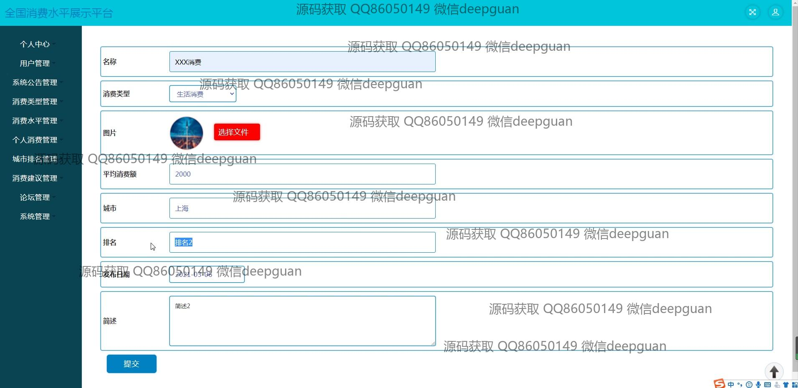

<h1 align="center">全国消费水平排行展示平台</h1>

## 简介
全国消费水平排行展示平台：角色分为管理员、用户；功能包括用户管理、消费类型管理、城市排名管理、系统公告管理、消费建议管理、论坛管理、个人消费管理等。设计简洁，支持信息录入、查询、发布及交流。    --计算机毕业设计源码；毕设源码；java毕业设计源码

## 联系方式

<h3 align="center">获取完整代码与数据库文件 + 微信：deepguan QQ: 86050149 QQ群: 783742310</h3>

<h3 align="center">可帮忙远程部署 包运行成功！提供远程部署、修改代码、设计文档指导、代码讲解等服务！</h3>

## 功能介绍（完整见运行截图）
管理员：基本功能包括登录、注册和退出。管理员可以通过导航栏管理用户、系统公告、消费类型、城市排名、论坛和客服。用户管理功能允许管理员维护和更新用户信息。消费类型管理用于分类和调整消费类别。城市排名管理有助于展示和分析各城市消费水平的排名情况。论坛和客服模块支持信息交流与用户支持。公告发布和管理功能帮助管理员有效沟通和发布重要信息。

用户：基本功能包括登录、注册和退出。用户界面提供个人信息管理，可以查看和修改个人资料。在消费信息管理模块中，用户可以输入和提交消费数据，包括消费名称、类型、金额和城市排名，同时可以上传相关图片。论坛管理允许用户参与讨论和提出建议。用户可以查看消费建议和系统公告，通过查询和筛选获取所需信息。消费者还可与客服进行实时交互，获取帮助和支持。

## 运行截图

本代码来源于网络,仅供学习参考使用!

